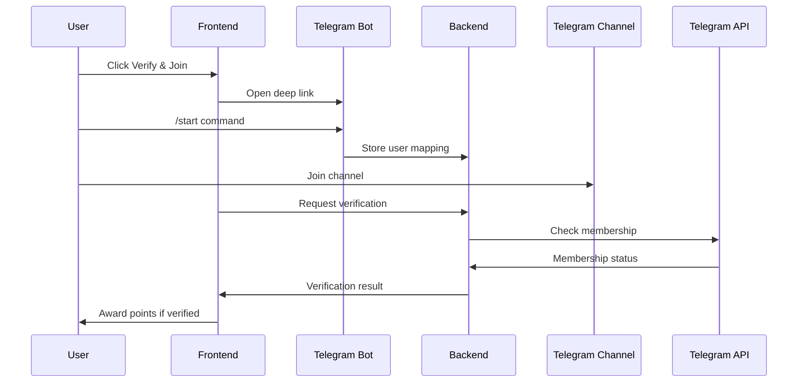

# Telegram Channel Verification Setup Guide

## Overview
This implementation verifies that users have actually joined your Telegram channel before awarding points, preventing fake completions.

## Architecture
1. **Frontend** - React app that initiates verification
2. **Backend API** - Node.js server that verifies membership via Telegram Bot API
3. **Telegram Bot** - Authenticates users and checks channel membership

## Setup Instructions

### 1. Create a Telegram Bot
1. Open Telegram and search for **@BotFather**
2. Send `/newbot` command
3. Choose a name for your bot (e.g., "Agentify Airdrop Bot")
4. Choose a username ending in `bot` (e.g., `agentify_airdrop_bot`)
5. Save the **Bot Token** you receive

### 2. Set Up Your Telegram Channel
1. Create your Telegram channel if you haven't already
2. Add your bot as an **Admin** to the channel
3. Get your channel ID:
   - For public channels: Use `@your_channel_name`
   - For private channels: Forward a message from the channel to @userinfobot to get the ID

### 3. Configure Environment Variables

#### Frontend (.env)
```env
REACT_APP_TELEGRAM_BOT_USERNAME=your_bot_username
REACT_APP_TELEGRAM_CHANNEL_LINK=https://t.me/your_channel
REACT_APP_API_URL=http://localhost:3000/api
```

#### Backend (.env)
```env
TELEGRAM_BOT_TOKEN=your_bot_token_from_botfather
TELEGRAM_CHANNEL_ID=@your_channel_or_id
```

### 4. Install Backend Dependencies
```bash
npm install node-telegram-bot-api express cors
```

### 5. Implement Backend API
Use the provided `backend-telegram-api-example.js` as a template. Key endpoints:
- `POST /api/telegram/verify` - Verifies channel membership
- `POST /api/telegram/webhook` - Handles bot authentication
- `GET /api/telegram/status/:privyId` - Checks connection status

### 6. Database Schema Updates
Add to your User model:
```javascript
{
  privyId: String,
  accumulatedPoints: Number,
  completedTasks: {
    telegram: Boolean,
    twitter: Boolean,
    discord: Boolean,
    github: Boolean
  }
}
```

Create TelegramUser model:
```javascript
{
  privyId: String,
  telegramUserId: String,
  username: String,
  connectedAt: Date
}
```

## How It Works

### User Flow
1. User clicks "Verify & Join" for Telegram task
2. Opens Telegram bot with deep link containing their Privy ID
3. User starts bot with `/start` command
4. Bot stores the mapping between Telegram ID and Privy ID
5. User joins the Telegram channel
6. Frontend calls verification API
7. Backend checks if user is a channel member via Telegram Bot API
8. If verified, points are awarded and task marked complete

### Verification Process


## Security Features
- Server-side verification prevents client-side manipulation
- Bot authentication links Telegram accounts to app accounts
- Points only awarded once per task per user
- Membership checked in real-time via Telegram API

## Testing

### Local Testing
1. Start your backend server with Telegram bot token
2. Create a test channel and add your bot as admin
3. Run the frontend and connect wallet
4. Click "Verify & Join" for Telegram
5. Complete bot authentication
6. Join the test channel
7. Verify that points are awarded

### Production Deployment
1. Set up webhook URL for your bot:
   ```bash
   curl -F "url=https://yourdomain.com/api/telegram/webhook" \
        https://api.telegram.org/bot<YOUR_BOT_TOKEN>/setWebhook
   ```
2. Use HTTPS for webhook endpoint
3. Implement rate limiting for verification requests
4. Add error logging and monitoring

## Troubleshooting

### Common Issues
1. **"Bot not found"** - Check bot username in .env
2. **"User not found in channel"** - Ensure bot is admin in channel
3. **"Invalid channel ID"** - Verify channel ID format
4. **Points not updating** - Check database update logic

### Debug Checklist
- [ ] Bot token is valid
- [ ] Bot is admin in channel
- [ ] Channel ID is correct format
- [ ] Backend server is running
- [ ] Database is connected
- [ ] CORS is configured for frontend

## Extension Ideas
1. Add periodic re-verification
2. Implement role-based points (admins get more)
3. Track engagement metrics
4. Add referral bonuses for bringing users to channel
5. Implement similar verification for other platforms